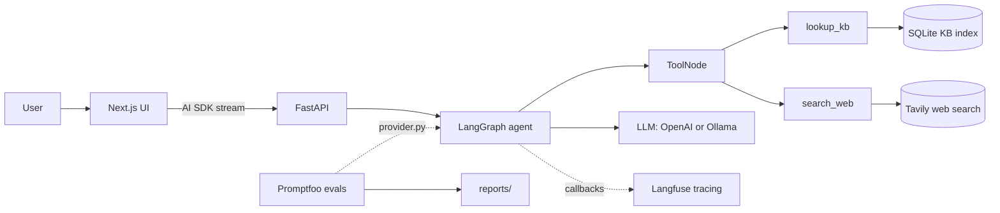

# Wellness Assistant

A multi-turn wellness agent on **LangGraph** that answers diet, exercise, sleep, and lifestyle questions.

- Grounded in a curated knowledge base via `lookup_kb` (hybrid BM25 + vector search).
- Falls back to `search_web` (Tavily) for anything outside the KB.
- Swappable LLM: set `WELLNESS_PROVIDER` to `openai` (frontier) or `ollama` (self-hosted OSS) — same architecture.
- Observability via **Langfuse**; safety/quality via **Promptfoo** evals.

## System design




## Why (build vs buy)

- We **build** the agent — quality and performance are the product differentiator.
- We **buy/rely on** Langfuse for tracing/observability instead of reinventing telemetry.
- We **buy/rely on** Promptfoo for evals/red-teaming instead of a home-grown harness.
- Net: engineering effort stays focused on agent behavior; observability and evals are handled by leading platforms.


## Eval reports

- Red-team + comparison reports live in [reports/](reports/), including [reports/model-comparison.md](reports/model-comparison.md).
- Generated with Promptfoo red-team (`promptfoo redteam generate` then `promptfoo eval`) against `gpt-5.4-mini` and local `qwen2.5`.


## What I'd improve given more time

**A. Agent optimization + deployment**

- Push agent evals to ~99.9% on the self-hosted model via guardrails + prompt engineering.
- Deploy the self-hosted model on the smallest viable GPU via Kubernetes with autoscaling — quantization, KV cache, and continuous batching enabled by default.

**B. Product features (personalization)**

- Add basic agentic UI elements edit prompt, chat branching, chat compaction, third-party integrations like reminder app etc.
- Let users upload files and past reports to build a per-user knowledge base for tailored recommendations.
- Add long-term, per-user memory across sessions — and extend the eval harness to cover these personalized/long-term-memory flows.


## Run (Docker Compose)

```bash
cp .env.example .env        # set OPENAI_API_KEY and  TAVILY_API_KEY
docker compose up --build
```

- Frontend: [http://localhost:3000](http://localhost:3000)
- Backend: [http://localhost:8000](http://localhost:8000) (health: `/health`)
- `OPENAI_API_KEY` powers both chat and KB embeddings; the KB index builds on first boot and persists in the `wellness-data` volume.


## Run evals on your own dataset

```bash
cd backend
uv run wellness index                                   # build the KB index once
uv run npx promptfoo eval -c evals/promptfooconfig.yaml  # functional (hallucination + refusal)
uv run npx promptfoo view                                # view results
```

Red team (bias / harmful / safety):

```bash
cd backend
uv run npx promptfoo redteam generate -c evals/redteam.config.yaml -o evals/redteam.yaml  # regenerate attacks
uv run npx promptfoo eval -c evals/redteam.yaml                                           # score (repeatable)
uv run npx promptfoo redteam report
```

- Edit functional datasets in [backend/evals/datasets/](backend/evals/datasets/).
- Edit plugins/strategies in [backend/evals/redteam.config.yaml](backend/evals/redteam.config.yaml), then regenerate `redteam.yaml`.


## Demo

Demo video: [assets/demo.mp4](assets/demo.mp4)

<video src="assets/demo.mp4" controls width="100%"></video>